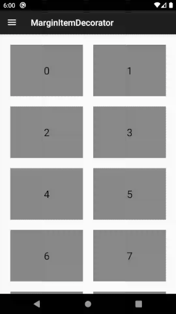
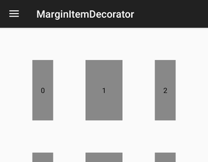

# EqualSpace-ItemDecorator
An RecyclerView which places equal Space/Gap/Margin between RecyclerView Items. (Supporting LinearLayout, GridLayout, Rtl and Horizontal)

How to use
-----
```kotlin
val recyclerView = //...
val space = //
val includeEdge = // false if you want no space between border items and recyclerView
recyclerView.addItemDecoration(SpaceItemDecoration(space /*in Px*/, includeEdge))
```



All of code is in a single file of 
[SpaceItemDecoration](spaceitemdecoration/src/main/java/me/farahani/spaceitemdecoration/SpaceItemDecoration.kt), 
feel free to copy/paste it in your code.

### Can I used it for StaggeredGridLayout?
Short answer, **NO**! For more detailed answer continue reading...

---

## More Info
### Why this is library?
Equal space between RV items is a common scenario and it could be achieved simply by setting
margin=space-value/2 for items layouts and padding=space-value/2 for RV. I wanted to reuse item
layouts and more importantly, I don't like that! :)
And what if you don't want that space between items and RV itself?

So I thought, no problem, I could write a custom `ItemDecoration`, set `outRect.\*=space/2` for
all items and if items are at border of the list, border sides should have `outRect.\*=space`.
Not only it was harder that what it looked first (supporting combination of orientation and layout direction),
but also result was wrong! See below:



It's because items size is fixed and calculated by RV. So in this way, border items get 3/2space
and become smaller than middle items. It forced me to grab a pen and paper and find a formula
which in addition to implementation, took more times than it should  (for a task as simple as setting equal space).
So I make it a library and I'm hopeful it saves some people some hours.

### Why StaggeredGridLayout is not supported?
An item span index is not deterministic in SGL, for example an item could be at left most position
in second row, but actually be last item. SGL.LayoutParams provide a spanIndex value which could
be all I needed, but when scrolling, items could be shuffled after the spanIndex is set and so its unreliable.